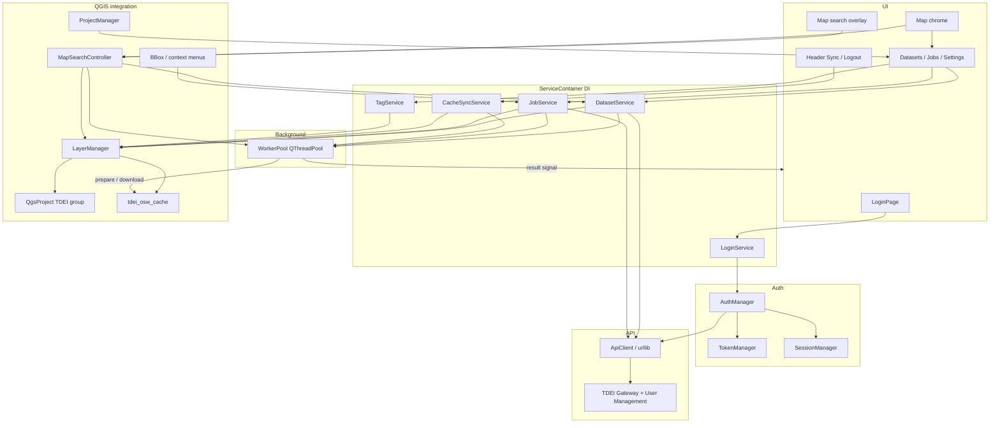
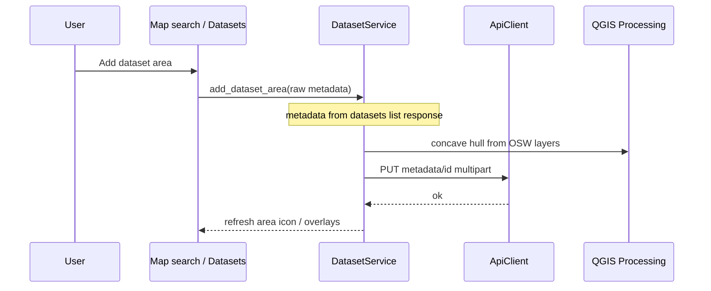
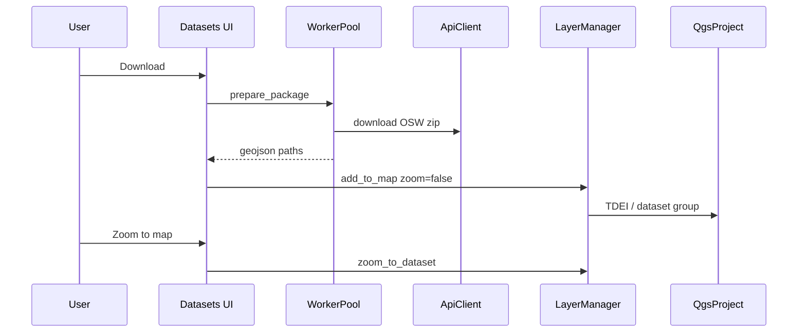

# TDEI QGIS Plugin — Presentation Deck

Slide-ready outline for stakeholders, users, and developers.

**Narrative arc:** *Why → Goals → Features → Demo → How it works → TODO → Next steps → Usage guide → Close → Learning*

**Positioning:** The **TDEI Portal** (OpenSpec) is where users self-manage account, groups, and platform activities. The **TDEI OpenSpec / API** also serves downstream developers. **Data work** — visualizing datasets and job outputs, then acting on them — still requires a GIS desktop (**QGIS** or **JOSM**). This plugin brings those focused data jobs into QGIS so users stay in one place, against the same API, with a portal-like feel scoped to mapping and jobs.

---

## Slide 1 — Title

**TDEI QGIS Plugin**  
Focused data jobs for OpenSidewalks — **inside QGIS**, powered by the TDEI API

*Author / Team · Date*  

Tagline: *Portal for self-management · Plugin for map & data jobs — one OpenSpec*

---

## Slide 2 — Agenda

1. Why a QGIS plugin (portal + OpenSpec context)  
2. Goals  
3. Features shipped today  
4. Demo walkthrough  
5. Architecture flow  
6. TODO — identity & environments  
7. Next steps  
8. Plugin usage guide  
9. Q&A  
10. Learning resources  

---

## Slide 3 — Why this plugin

**Today**

- **TDEI Portal**  
  Self-manage account, groups, and platform work  

- **TDEI OpenSpec / API**  
  One contract for the portal, apps, and downstream developers  

- **QGIS / JOSM**  
  Where datasets and job outputs get visualized and acted on  

**The gap**

- **Portal ↔ desktop hop**  
  Manage on the portal → leave for GIS → return to run jobs and check status  

**Why this plugin**

- **Companion for map & data jobs**  
  Portal-like workflows **inside QGIS**, on the same API — without replacing the portal  

---

## Slide 4 — Goals

1. **Reduce portal ↔ GIS switching** for visualize / download / job / track loops  
2. **Feel like TDEI** — branded, multi-env, API-faithful — but **focused** on data & map tasks  
3. **Production-ready** — reliable, maintainable, upgradable  
4. **Secure auth** — same identity story as the platform; session expiry without closing QGIS  
5. **OpenSpec-aligned jobs** — extensible as the catalog grows  
6. **QGIS-native** — layers, canvas, and projects users already know  

---

## Slide 5 — Features shipped

- **Identity**  
  Sign-in and session restore  

- **Map search**  
  Sticky map overlay: search by extent or name; green/red area icons; highlight & zoom  

- **Datasets**  
  Browse, filter, download, and open datasets on the map  

- **Add dataset area**  
  ⋮ action: concave-hull area → API metadata → edit-metadata upload  

- **Mapped**  
  Zoom, clip, tag, search, and manage what is on the map  

- **Jobs**  
  Run and track jobs; open results without leaving QGIS  

- **Sync**  
  Refresh TDEI layers in the open project when needed  

- **Settings**  
  Per-environment API URLs; basemap and preferences  

---

## Slide 6 — Demo walkthrough

1. Open plugin → sign in (fresh install opens the sign-in panel)  
2. Map search → pan/zoom → see datasets in view; click to highlight, double-click to zoom  
3. Datasets → open a dataset on the map  
4. Optional: ⋮ **Add dataset area** on a red (missing area) row  
5. Mapped → organize with tags  
6. Layer menu → run **Validate** (job via API — no separate portal trip)  
7. Jobs → open the result  
8. Optional: **Sync** to refresh TDEI layers in the project  

*Live demo or screenshots — show the “stay in QGIS” story vs portal ↔ desktop hopping.*

---

## Slide 7 — Architecture flow diagram

**Layered flow — UI never talks to the network or tokens directly**



**Add dataset area (happy path)**



**Data / map path (happy path)**



**Principles**

- Clear separation: UI → services → API → QGIS  
- Same TDEI API / OpenSpec the portal and developers already use  
- Background work for network; map updates stay smooth in QGIS  

*(Details: [ARCHITECTURE.md](ARCHITECTURE.md))*

---

## Slide 8 — TODO — Identity & environments

Open work to harden who sees which environments:

- **Internal users — multi-env**  
  Keep Dev / Staging / Production available for internal operators  

- **External users — Production only**  
  Restrict partner / public users to Production in the status-bar switcher  

- **Identity policy in the plugin**  
  Drive the allowed env list from auth / user-management claims after sign-in  

*(Shipped: per-env URL tabs in Settings, status-bar env switch with logout, downloads cached per environment.)*

---

## Slide 9 — Ask / next steps

- Pilot with a project group that today hops portal → QGIS/JOSM → portal  
- Collect mapper / steward UX feedback (does it feel like TDEI, focused on data?)  
- Align release with TDEI OpenSpec / API milestones  

---

## Slide 10 — Plugin usage guide

### Install

1. Build ZIP from the plugin root:

   ```bash
   python3 scripts/package_plugin.py
   # → dist/tdei.zip
   ```

   Or copy the folder into `python/plugins/tdei`.

2. QGIS → **Plugins → Manage and Install Plugins** → Install from ZIP / Enable **TDEI**
3. Open via menu or **Ctrl+Shift+T** (⌘⇧T)

### First run on a new machine

- There is **no** saved session after a ZIP install — **sign in** before map search  
- Toolbar opens the **TDEI sign-in panel** until authenticated; then defaults to map search  

### Map search & dataset area

- **Green** map icon = `dataset_area` in the API response; **red** = missing  
- **⋮ → Add dataset area** builds a concave hull from OSW layers, updates metadata from the list response, and uploads via edit-metadata  
- TDEI panel and map search are **mutually exclusive** (map chrome switches modes)  

### Good habits

- Use the **portal** for broad self-management; use the **plugin** for map & data jobs  

---

## Slide 11 — Thanks / Q&A

**TDEI QGIS Plugin** — questions?

*Portal for self-management · Plugin for focused data jobs · One OpenSpec*

Repo · docs · contact

---

## Slide 12 — Learning resources

### Official

- [QGIS Python (PyQGIS) Cookbook](https://docs.qgis.org/latest/en/docs/pyqgis_developer_cookbook/)  
- [Developing Python Plugins](https://docs.qgis.org/latest/en/docs/pyqgis_developer_cookbook/plugins/index.html)  
- [Plugin metadata & structure](https://docs.qgis.org/latest/en/docs/pyqgis_developer_cookbook/plugins/plugins.html)  
- [QGIS API documentation](https://qgis.org/pyqgis/)  
- [Publishing a plugin](https://docs.qgis.org/latest/en/docs/pyqgis_developer_cookbook/plugins/releasing.html)  

### Community / training

- [QGIS Training Manual — PyQGIS](https://docs.qgis.org/latest/en/docs/training_manual/index.html)  
- [QGIS Plugin Planet / Hub](https://plugins.qgis.org/) — study well-maintained plugins  
- [Qt for Python / signals & slots concepts](https://doc.qt.io/qtforpython/) (patterns also apply via `qgis.PyQt`)  
