# TDEI QGIS Plugin — User Handbook

A practical guide to finding, viewing, and working with TDEI OpenSidewalks (OSW) datasets without leaving QGIS.

---

## Contents

1. [What the plugin does](#1-what-the-plugin-does)
2. [Before you start](#2-before-you-start)
3. [Install the plugin](#3-install-the-plugin)
4. [Open the plugin and sign in](#4-open-the-plugin-and-sign-in)
5. [Find your way around](#5-find-your-way-around)
6. [Search datasets on the map](#6-search-datasets-on-the-map)
7. [Browse and download datasets](#7-browse-and-download-datasets)
8. [Add a missing dataset area](#8-add-a-missing-dataset-area)
9. [Manage datasets on the map (Mapped tab)](#9-manage-datasets-on-the-map-mapped-tab)
10. [Preview OSW without downloading](#10-preview-osw-without-downloading)
11. [Run TDEI jobs](#11-run-tdei-jobs)
12. [Track jobs and open results](#12-track-jobs-and-open-results)
13. [Restore layers with Sync](#13-restore-layers-with-sync)
14. [Settings and environments](#14-settings-and-environments)
15. [Troubleshooting](#15-troubleshooting)
16. [Appendix A — Map colors and icons](#appendix-a--map-colors-and-icons)
17. [Appendix B — Screenshot shot list](#appendix-b--screenshot-shot-list)

---

## 1. What the plugin does

The **TDEI Portal** is where you manage your account, project groups, and platform work. The **TDEI QGIS plugin** covers the map side of that work, inside QGIS:

- Search for OSW datasets in the area you're looking at on the map
- Download datasets into QGIS as layer groups
- Preview published datasets as streamed tiles, without downloading
- Add a missing dataset area (the dataset's boundary polygon) and save it back to TDEI
- Run TDEI jobs such as **Validate**, **Sanitize**, **Convert**, and **Self Merge**, then open the results on the map
- Restore your TDEI layers after QGIS crashes or you open a new project

The plugin uses the same TDEI API as the portal, so what you see here matches the portal.

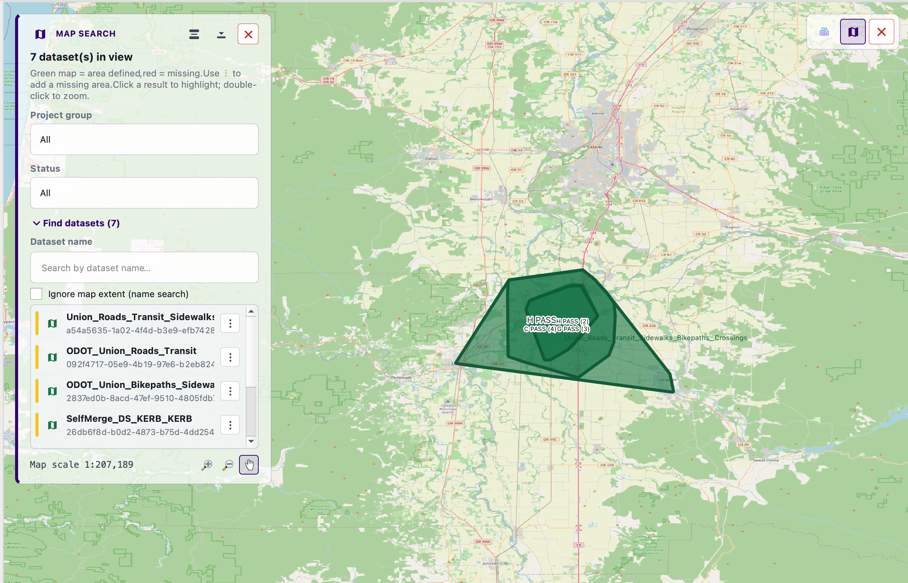

---

## 2. Before you start

You'll need:

| Requirement | Details |
|-------------|---------|
| QGIS | Version **3.28 or newer** |
| TDEI account | The same credentials you use for the TDEI Portal |
| Project group access | Membership in at least one project group, so datasets are visible to you |
| Network | Access to the TDEI API for your environment (Development, Staging, or Production) |

You don't need to install anything else. The plugin runs on the Python that ships with QGIS.

---

## 3. Install the plugin

You'll normally get the plugin as a ZIP file, such as `tdei.zip`, from your team.

1. In QGIS, open **Plugins → Manage and Install Plugins…**
2. Choose **Install from ZIP** in the left sidebar.
3. Browse to `tdei.zip` and click **Install Plugin**.
4. Go to **Installed** and make sure **TDEI** is ticked.

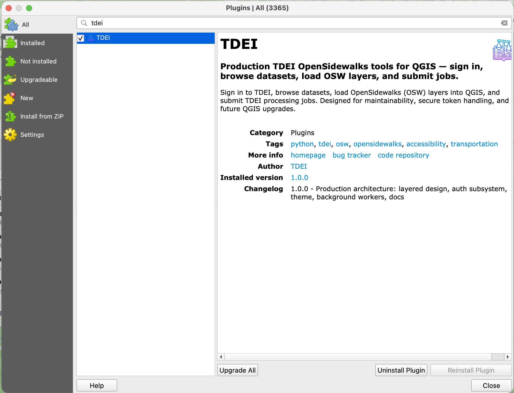

After installing, you'll see the TDEI icon on the toolbar and a **TDEI** entry under the **Plugins** menu.

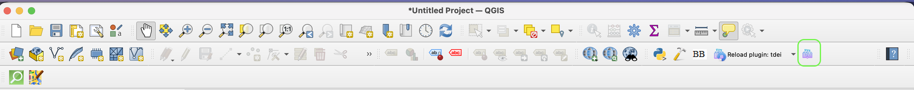

> **Upgrading:** Install the new ZIP the same way. QGIS replaces the old version. Restart QGIS if the plugin behaves oddly afterward.

---

## 4. Open the plugin and sign in

### Open the plugin

Use one of these:

- Click the **TDEI** toolbar icon
- Choose **Plugins → TDEI**
- Press **Ctrl+Shift+T** (Windows/Linux) or **⌘⇧T** (macOS)

The first time you open it, the **TDEI panel** appears on the map with the sign-in screen. Once you're signed in, the same shortcut opens **map search** instead.

### Sign in

1. Check the **environment** shown on the sign-in screen (Development, Staging, or Production). Your team will tell you which one to use.
2. Enter your TDEI **Username / Email** and **Password**.
3. Click **Sign in**.

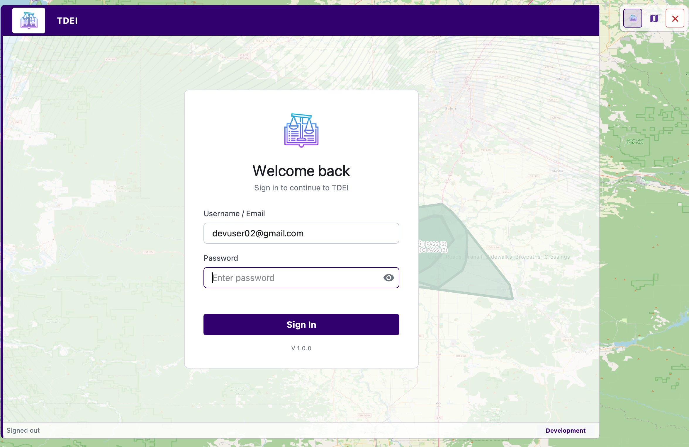

Your session stays saved on this computer, so you won't have to sign in each time you open QGIS. When a session expires, the plugin asks you to sign in again. QGIS itself keeps running.

> **New computer or fresh install?** Sessions aren't included in the ZIP. Sign in once on each computer.

---

## 5. Find your way around

### Map chrome (top-right corner of the map)

A small set of buttons stays in the top-right corner of the map canvas:

| Button | What it does |
|--------|--------------|
| **TDEI** | Show or hide the TDEI panel |
| **Map search** | Turn map search on or off |
| **Close** | Hide all TDEI panels. The plugin stays installed, and you can reopen it at any time. |

The TDEI panel and map search take turns: opening one hides the other.

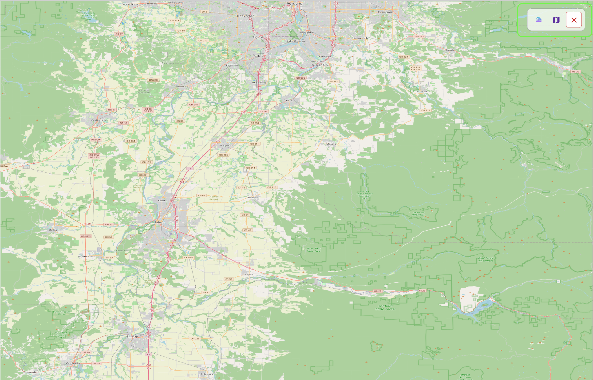

### The TDEI panel

The TDEI panel covers most of the map and has:

- **Header** — the **Sync** and **Logout** buttons
- **Sidebar** — **Dashboard**, **Datasets**, **Jobs**, and **Settings**
- **Status bar** — progress messages and the current environment (click it to switch)

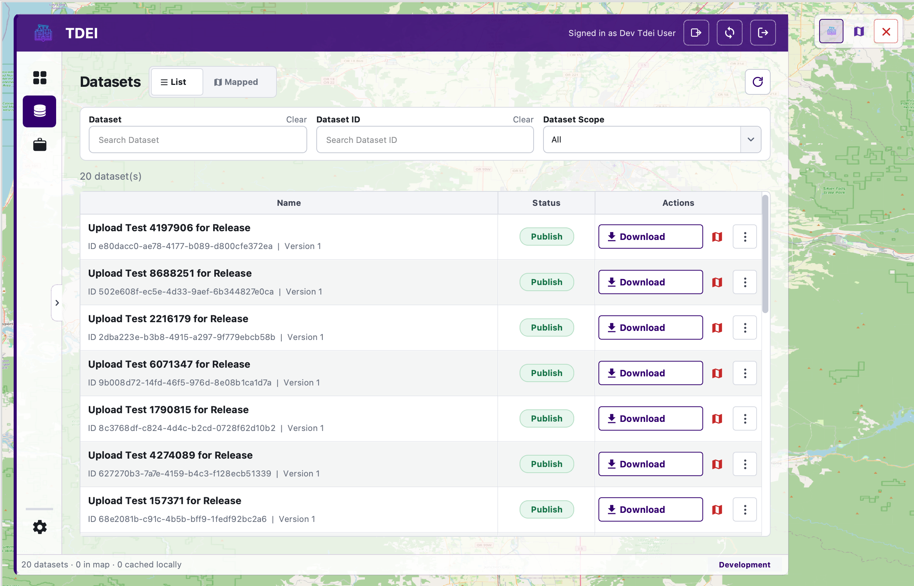

### Layers the plugin creates

Downloaded data goes under a **TDEI** group in the QGIS **Layers** panel, with one sub-group per dataset. Each sub-group can include a `dataset_area` layer showing the dataset's boundary.

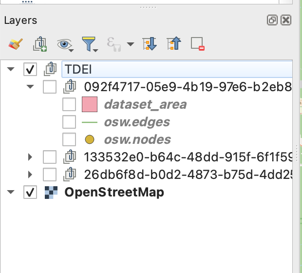

---

## 6. Search datasets on the map

Map search lists the TDEI datasets that overlap your current map view.

### Start a search

1. Sign in (see [section 4](#4-open-the-plugin-and-sign-in)).
2. Click **Map search** in the map chrome, or press **Ctrl+Shift+T**.
3. Pan and zoom to your area of interest. The results update each time the map stops moving.

Map search only runs when you're zoomed in far enough (roughly **1:1,300,000** or closer). If you're zoomed out further, the panel shows **Zoom in to search**.

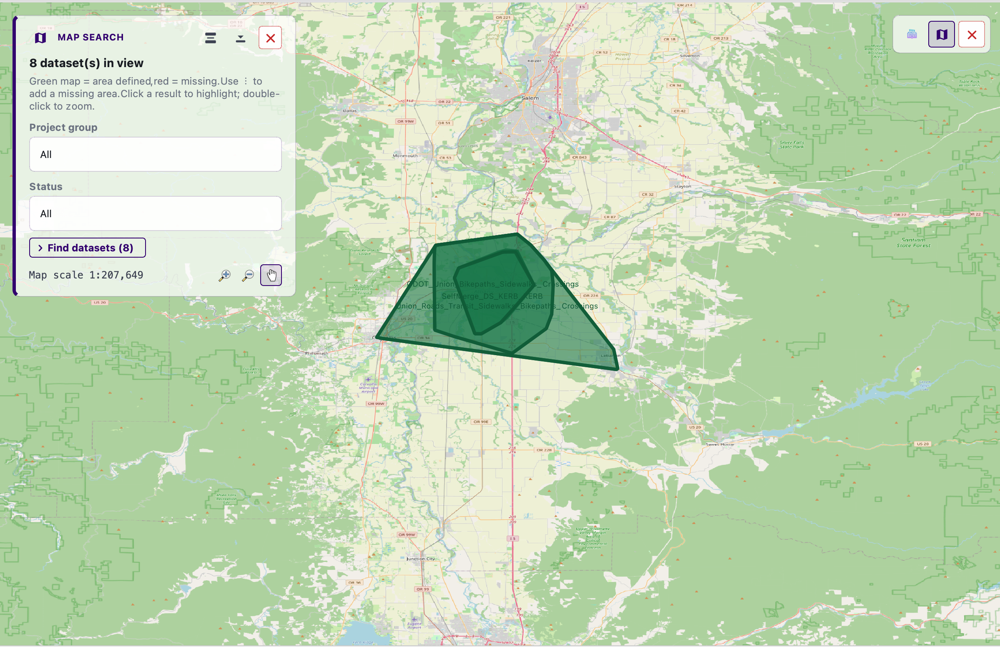

### Filters

| Filter | Options |
|--------|---------|
| **Project group** | **All** (default, no group filter), **My Project Groups** (every group you belong to), or one specific group |
| **Status** | **All**, **Publish**, or **Pre-Release** |
| **Dataset name** | Type part of a name. Suggestions come from names you've already seen. |
| **Ignore map extent** | Search by name everywhere, not just within the current view |

Typing a name automatically searches outside the current view too.

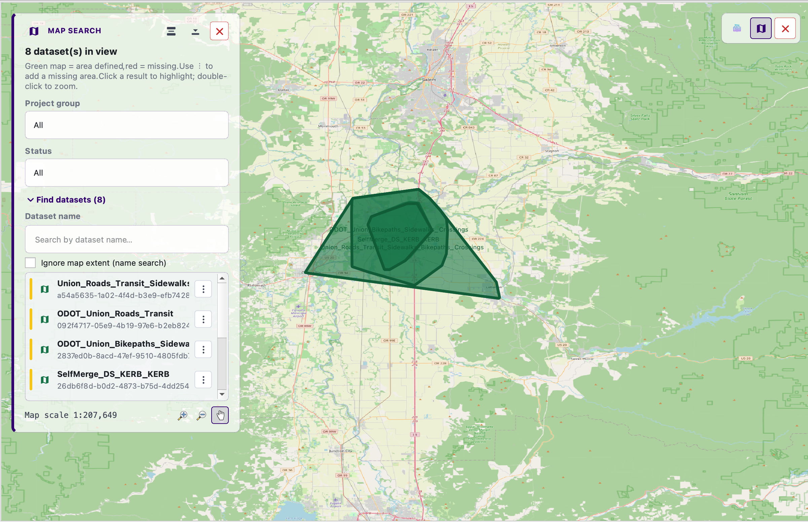

### Work with results

- **Click** a result to highlight its area on the map without moving the map.
- **Double-click** a result, or press **Enter**, to zoom to it.
- The **map icon** next to each result shows whether the dataset has an area: **green** means it has one, **red** means it's missing.
- The **colored stripe** on the left of each result shows its status: **purple** for Publish, **yellow** for Pre-Release.
- The **⋮** button opens more actions for that dataset (see [section 8](#8-add-a-missing-dataset-area)).
- Right-click an area polygon on the map for its **TDEI** menu, which includes **Download**, **Zoom to dataset**, and **View OSW**.

A **purple stripe moving along the left edge** of the panel means a search or action is still running.

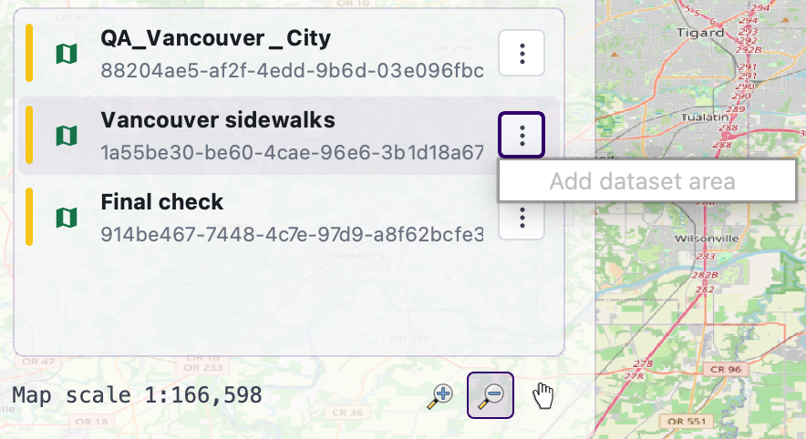

### Panel size

Use the buttons in the panel header to switch between full size, **compact** (search section hidden), and **small** (title bar only). Click the map icon or **MAP SEARCH** title to expand the panel again.

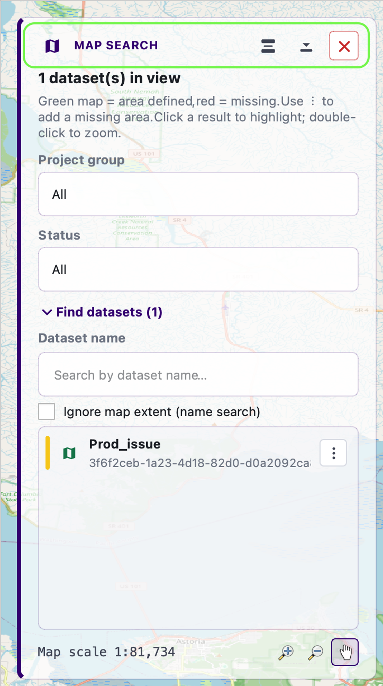

---

## 7. Browse and download datasets

Open **Datasets** from the TDEI panel sidebar.

### The List tab

The **List** tab shows every dataset you can access, newest first.

- **Dataset Name / Dataset ID** — type to filter
- **Dataset Scope** — **All** (default), **My Project Groups**, or one specific group
- Scroll to the bottom to load more datasets
- Click **Refresh** to reload the list

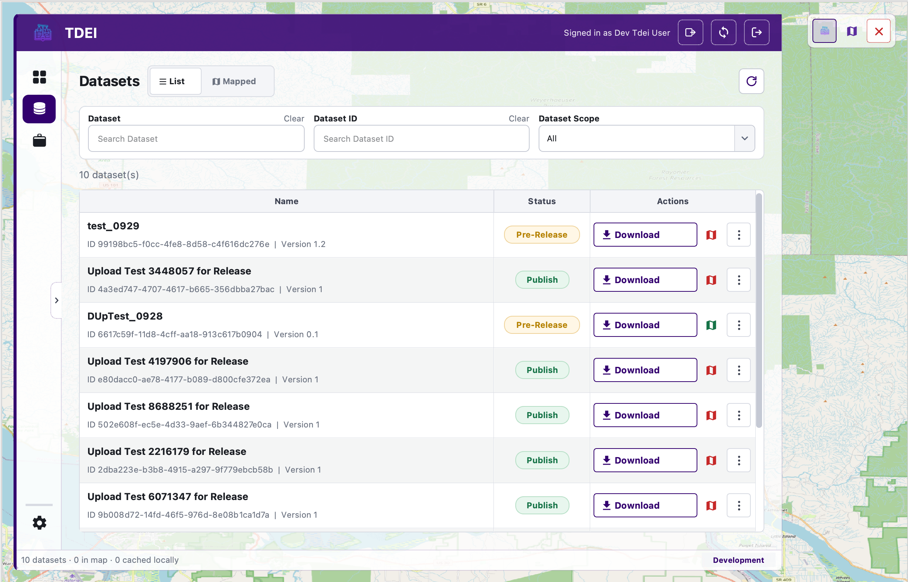

### Download a dataset

1. Find the dataset in the list.
2. Click **Download**. The button changes to **Downloading…** while it works.
3. When it finishes, the layers appear under the **TDEI** group and the button changes to **Zoom to map**.
4. Click **Zoom to map** to go to the dataset.

Downloads are kept on your computer. Downloading the same dataset again reuses the saved copy, so it's much faster.

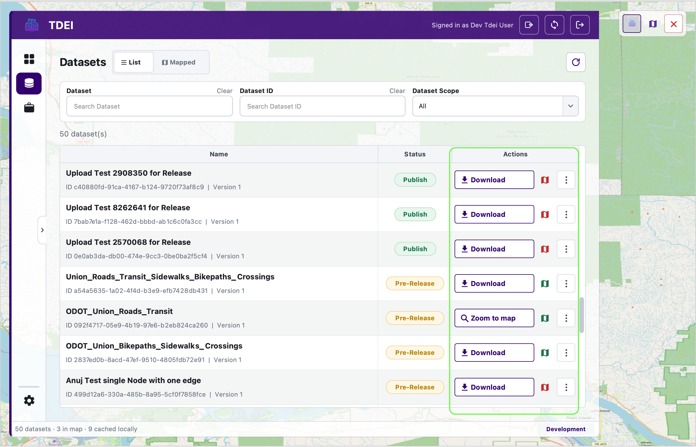

### Row actions (⋮)

Each row's **⋮** menu can include:

- **Add dataset area** — shown when the area is missing (see [section 8](#8-add-a-missing-dataset-area))
- **Self Merge** — runs the Self Merge job on this dataset (see [section 11](#11-run-tdei-jobs))

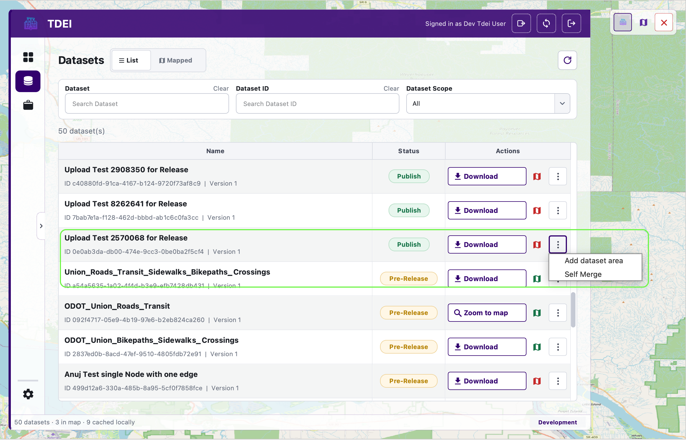

---

## 8. Add a missing dataset area

Every dataset should have a **dataset area**: a polygon showing where its data is. When one is missing, the map icon is **red** and the dataset can't be drawn or zoomed to in map search.

### Steps

1. In **map search** or **Datasets → List**, find a dataset with a **red** map icon.
2. Click **⋮ → Add dataset area**.
3. Wait while the plugin:
   - downloads the dataset's OSW layers, if they aren't already on your computer
   - builds the area from the dataset's edges and nodes, closely following the shape of the data (a *concave hull*)
   - adds the area to the dataset's metadata and saves it to TDEI
4. When a confirmation message appears, the map icon turns **green** and the area shows up on the map.

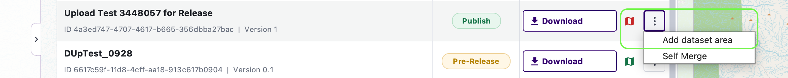

> **Good to know**
> - The area is saved to TDEI, so other users will see it too.
> - If you've already downloaded the dataset, the saved copy on your computer is updated as well, so later jobs use the new area.
> - **Add dataset area** isn't available (it's greyed out or hidden) when the dataset already has an area.

---

## 9. Manage datasets on the map (Mapped tab)

**Datasets → Mapped** lists the TDEI datasets and job outputs currently in your QGIS project.

| Action | What it does |
|--------|--------------|
| **Zoom** | Zoom the map to that dataset |
| **Clip** | Draw a box on the map and submit a clip job for just that area |
| **Delete** | Remove the dataset from the map and delete its saved copy on your computer |
| **Tags** | Add your own tags, such as `#review`, to group and find datasets |
| **Search** | Filter by name or by `#tag` |
| **Delete selected** | Remove every ticked row at once |

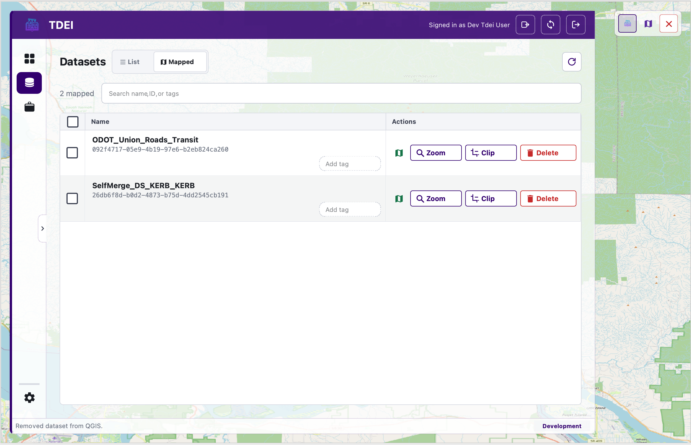

### Clip a dataset

1. Click **Clip** on a mapped dataset. The TDEI panel, map search, and map buttons hide so the whole map is free for drawing.
2. Draw a box on the map. Use **Zoom** or **Pan** on the clip toolbar if you need to adjust the view.
3. Check the box in the clip toolbar and click **Run clip**, or **Cancel** (Esc) to stop.
4. The TDEI panel comes back when you finish or cancel. Track the job on the **Jobs** page.

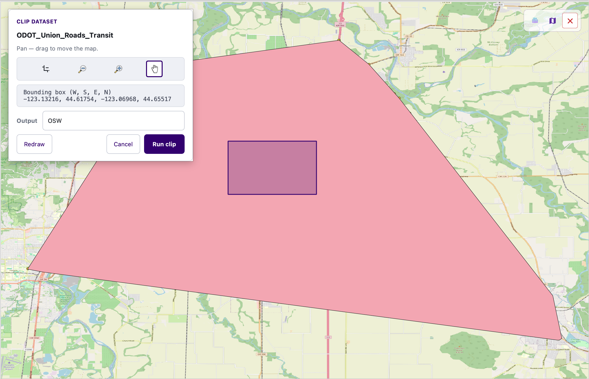

---

## 10. Preview OSW without downloading

You can view **published** datasets as streamed map tiles, which is quicker than downloading them.

1. In map search, right-click the dataset's area polygon on the map.
2. Choose **TDEI → View OSW**.
3. The layers stream in; a short pulsing effect shows they're still loading.
4. To remove the preview, choose **TDEI → Stop viewing OSW**.

**View OSW** is greyed out, with the reason in its label, when:

- the dataset isn't published: **View OSW (not published)**
- viewing is turned off for the project group: **View OSW (not enabled at project group)**
- viewing is turned off for the dataset: **View OSW (not enabled at dataset)**

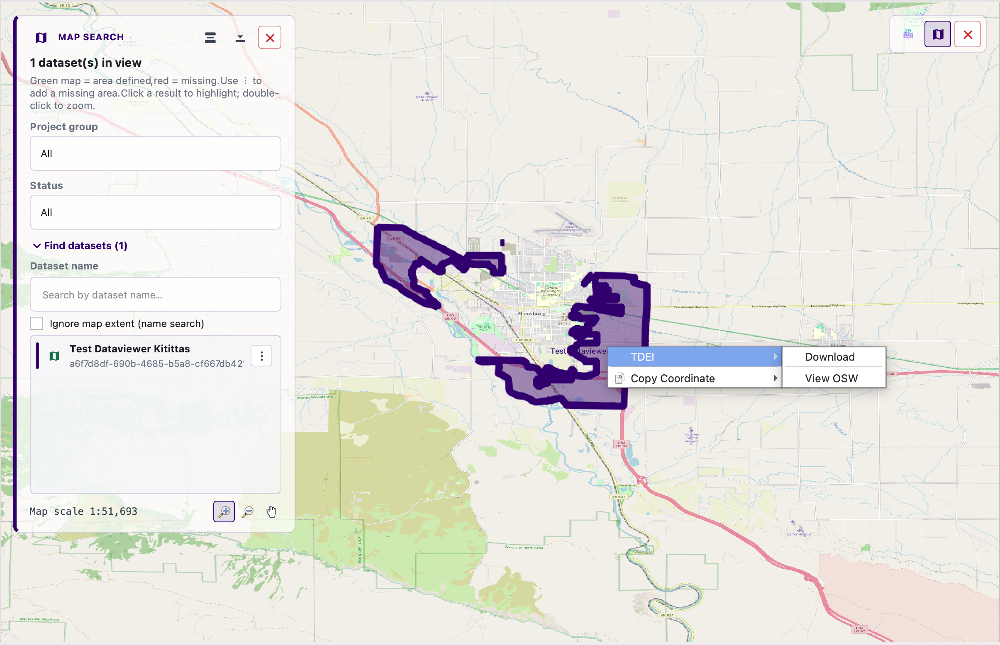

---

## 11. Run TDEI jobs

### Jobs from the Layers panel

1. Download the dataset (see [section 7](#7-browse-and-download-datasets)).
2. In the QGIS **Layers** panel, right-click the dataset group (or select layers inside it).
3. Choose **TDEI Jobs**, then **Validate**, **Sanitize**, or **Convert**.
4. Review the form. The plugin prepares the upload file (`osw_upload.zip`) from your layers automatically; click **Browse…** only if you want to upload a different file.
5. Click **Run job** and wait for the progress dialog to finish.

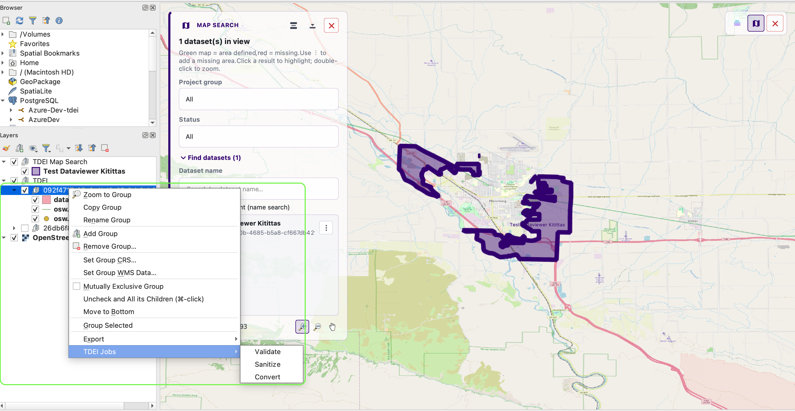

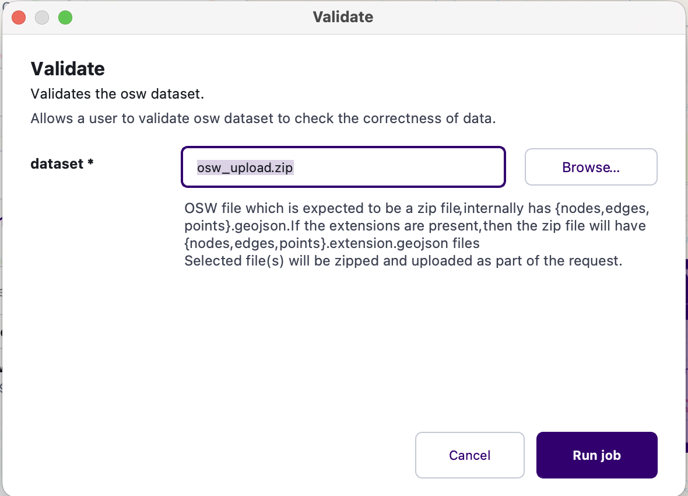

> **File naming matters.** Only GeoJSON layers named to OSW conventions (for example `edges`, `nodes`, `points`, `lines`, `polygons`, `zones`) are uploaded. If some selected layers don't follow the convention, the plugin asks before leaving them out.

### Jobs from the Datasets list

Some jobs run on the dataset as stored in TDEI, so you don't need to download it first. Use **Datasets → List → ⋮ → Self Merge**.

---

## 12. Track jobs and open results

Open **Jobs** from the TDEI panel sidebar.

- Newest jobs are listed first, with their status (for example running, completed, or failed)
- Scroll to load more
- When a job has an output, click **Download** to download it and add it to the map
- Outputs go under the TDEI group, just like datasets

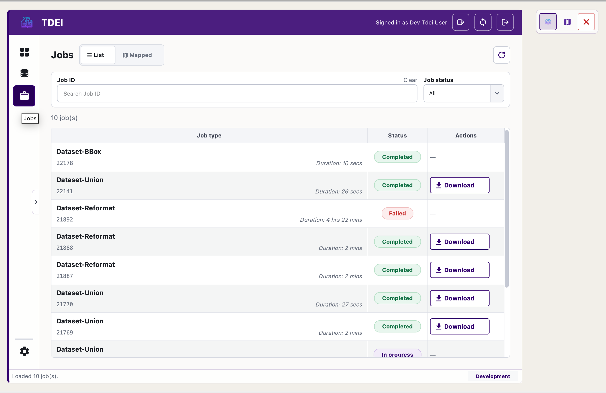

---

## 13. Restore layers with Sync

If QGIS crashes, you close a project without saving, or you open a new project, your downloaded data is still saved on your computer.

1. Open the TDEI panel.
2. Click **Sync** in the header.
3. The plugin rebuilds the **TDEI** layer group from the saved downloads, including your tags.

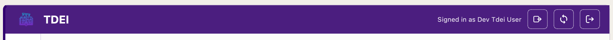

---

## 14. Settings and environments

Open **Settings** from the TDEI panel sidebar.

| Section | What you can change |
|---------|---------------------|
| **Environments** | API addresses for Development, Staging, and Production (usually left at their defaults) |
| **Request timeout** | How long to wait for the API before giving up |
| **Map → Basemap** | OpenStreetMap (default), Google Maps, Google Satellite, or None (no basemap). Click **Apply basemap now** to update the current project. |
| **Preferences** | Toast notifications, animations, jobs in the layer menu |
| **Session → Clear saved session** | Sign out and remove your saved sign-in from this computer |

Click **Save settings** when you're done.

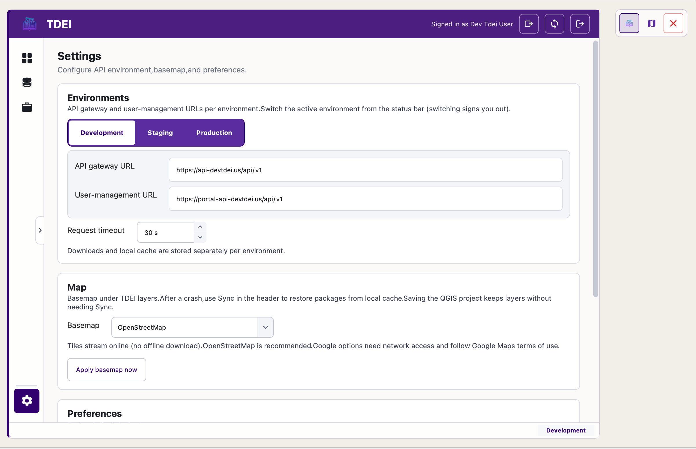

### Switch environment

Click the environment name in the TDEI panel's **status bar** and choose another one. Switching **signs you out**, because each environment needs its own sign-in. Downloads are kept separately for each environment.

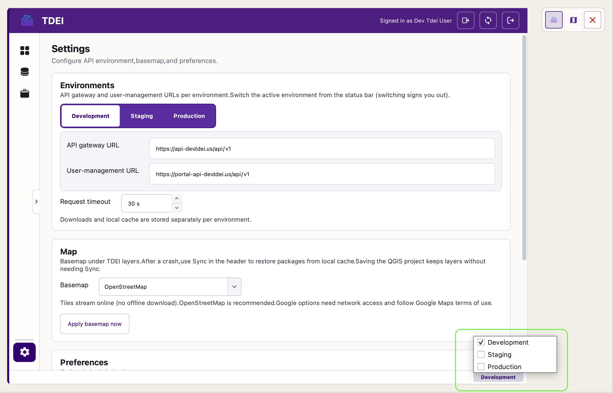

---

## 15. Troubleshooting

| What you see | What to do |
|--------------|------------|
| Toolbar opens the sign-in screen instead of map search | You're not signed in yet. Sign in, then open map search. |
| Map search says **Zoom in to search** | Zoom in closer, or type a dataset name, or tick **Ignore map extent**. |
| **No datasets in this view** | Pan or zoom elsewhere, set **Project group** to **All**, or check the **Status** filter. |
| Dataset is listed but can't be zoomed to | Its area is missing (red icon). Use **⋮ → Add dataset area**. |
| **View OSW** is greyed out | The label says why: not published, or viewing turned off for the project group or dataset. Download the dataset instead. |
| **Session expired** message | Sign in again. Your downloads and layers aren't affected. |
| Layers disappeared after reopening QGIS | Click **Sync** in the TDEI panel header. |
| Job won't submit: "not in a valid OSW naming convention" | Rename the GeoJSON layers to OSW names (`edges`, `nodes`, and so on) and try again. |
| Plugin looks out of date after an upgrade | Restart QGIS. |

For anything else, open **View → Panels → Log Messages** in QGIS, select the **TDEI** tab, and share what it says with your support contact.
---

## Appendix A — Map colors and icons

### Map search result list

| Indicator | Meaning |
|-----------|---------|
| Green map icon | Dataset area is defined |
| Red map icon | Dataset area is missing; you can add it with **⋮** |
| Purple left stripe on a result | Status is **Publish** |
| Yellow left stripe on a result | Status is **Pre-Release** |
| Moving purple stripe on the panel's left edge | A search or action is running |

### Map search area polygons

| Polygon color | Meaning |
|---------------|---------|
| Purple | Viewing is allowed, so **View OSW** is available if the dataset is published |
| Green | Viewing is turned off for this dataset |
| Yellow | Viewing is turned off for the dataset's project group |

The selected dataset is shown with a highlighted outline, not a solid fill.

---